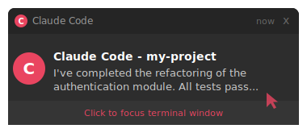

<p align="center">
  
</p>

<p align="center">
  <strong>Windows toast notifications for Claude Code with click-to-focus support.</strong><br/>
  Get notified when Claude finishes a task, needs permission, or completes a subagent<br/>
  and click the notification to instantly bring the terminal back to focus.
</p>

<p align="center">
  <a href="LICENSE"></a>
  <a href="https://github.com/MeninoNias/claude-code-notification/releases"></a>
  
  
  <a href="https://github.com/MeninoNias/claude-code-notification/stargazers"></a>
</p>

---

## Table of Contents

- [Features](#-features)
- [Demo](#-demo)
- [Quick Start](#-quick-start)
- [How It Works](#-how-it-works)
- [File Structure](#-file-structure)
- [Configuration](#-configuration)
- [Troubleshooting](#-troubleshooting)
- [Contributing](#-contributing)
- [License](#-license)

---

## Features

- **Task Complete** — notifies when Claude finishes a task with a summary of the response
- **Permission Required** — notifies when Claude needs user approval to proceed
- **Subagent Done** — notifies when a background agent completes its work
- **Click-to-Focus** — click any notification to bring the terminal window to the foreground
- **Zero Background Processes** — uses Windows protocol activation, not persistent listeners
- **Multi-Terminal** — works with Windows Terminal, VS Code, cmd, and any terminal with a window handle
- **Dual PowerShell** — supports both PowerShell 5.1 and 7+

---

## Demo

<p align="center">
  
</p>

> **Click the notification** and the terminal window comes back to focus instantly — no Alt+Tab needed.

### Notification Flow

```
  Claude finishes task          User clicks notification
         |                              |
         v                              v
  +-----------------+          +------------------+
  | show-toast.ps1  |          | claude-focus.ps1 |
  | Finds terminal  |  toast   | Win32 API focus  |
  | window (HWND)   | -------> | SetForeground    |
  | Shows toast     |  click   | BringToTop       |
  | with protocol   |          | AppActivate      |
  +-----------------+          +------------------+
```

---

## Quick Start

### Install with Claude Code

Just paste this prompt into Claude Code and let it handle everything:

```
Clone the repo https://github.com/MeninoNias/claude-code-notification and run the install.ps1 script to set up Windows toast notifications with click-to-focus for Claude Code.
```

### Manual Install

**Prerequisites:** Windows 10/11, [Claude Code](https://docs.anthropic.com/en/docs/claude-code) installed, PowerShell 5.1+

```powershell
git clone https://github.com/MeninoNias/claude-code-notification.git
cd claude-code-notification
powershell -ExecutionPolicy Bypass -File .\install.ps1
```

> **No admin required.** All changes are user-level only (HKCU registry, user profile, Start Menu).
> The `-ExecutionPolicy Bypass` flag is needed because Windows blocks `.ps1` scripts by default.

That's it! The installer handles everything:

| Step | What it does |
|------|-------------|
| 1 | Installs [BurntToast](https://github.com/Windos/BurntToast) module if missing |
| 2 | Copies notification scripts to `~/.claude/` |
| 3 | Registers `claude-focus://` protocol handler |
| 4 | Creates Start Menu shortcut for toast branding |
| 5 | Merges notification hooks into Claude Code `settings.json` |

> Safe to run multiple times. Use `.\install.ps1 -Force` to overwrite existing files.

### Uninstall

```powershell
.\uninstall.ps1
```

To also remove the BurntToast module:

```powershell
.\uninstall.ps1 -RemoveBurntToast
```

---

## How It Works

### Architecture

```
Claude Code hook (Stop / Notification / SubagentStop)
  |
  v
show-toast.ps1
  |-- Walks process tree to find terminal window (HWND)
  |-- Builds toast via BurntToast with protocol activation
  |-- Shows notification with launch URI: claude-focus://{HWND}
  v
[User clicks notification]
  |
  v
Windows protocol handler --> claude-focus.vbs --> claude-focus.ps1
  |-- Parses HWND from URI
  |-- Uses Win32 API to bring window to foreground:
  |     1. keybd_event (Alt trick for activation rights)
  |     2. AttachThreadInput + SetForegroundWindow + BringWindowToTop
  |     3. SetWindowPos TOPMOST flash
  |     4. WScript.Shell AppActivate fallback
  v
Terminal window is focused
```

### Why a VBS Wrapper?

When Windows triggers a protocol handler, it launches the registered command. Using `powershell.exe` directly would briefly **flash a console window**. The VBS wrapper (`WScript.Shell.Run` with window style `0`) launches PowerShell completely hidden — invisible to the user.

### PowerShell 5.1 vs 7+

| Feature | PS 5.1 | PS 7+ (pwsh) |
|---|---|---|
| Toast submission | WinRT API directly | BurntToast Submit-BTNotification |
| Custom AppId | "Claude Code" header | Falls back to BurntToast AppId |
| Click-to-focus | Yes | Yes |
| Focus methods | All 3 methods | All 3 methods |

---

## File Structure

### Repository

```
claude-code-notification/
  .github/              # CI, release workflows, issue/PR templates
  assets/               # Icon and banner
  config/
    hooks.json          # Hook definitions (merged into settings.json)
  src/
    show-toast.ps1      # Main notification script
    claude-focus.ps1    # Click-to-focus handler (Win32 API)
    claude-focus.vbs    # Hidden launcher for focus handler
  install.ps1           # One-command installer
  uninstall.ps1         # Clean uninstaller
```

### Installed Files (`~/.claude/`)

```
~/.claude/
  show-toast.ps1        # Main notification script
  claude-focus.ps1      # Click-to-focus handler
  claude-focus.vbs      # Hidden launcher
  claude-icon.png       # Notification icon
  settings.json         # Claude Code settings (hooks merged here)
```

### System Changes

| What | Where | Scope |
|------|-------|-------|
| Protocol handler | `HKCU:\Software\Classes\claude-focus` | User-level registry |
| Start Menu shortcut | `%APPDATA%\Microsoft\Windows\Start Menu\Programs\Claude Code.lnk` | Current user |
| Scripts | `%USERPROFILE%\.claude\` | Current user |

> All changes are **user-level only** — no admin required.

---

## Configuration

### Hook Events

The installer configures three Claude Code hooks:

| Hook | Fires when | Shows |
|------|-----------|-------|
| `Stop` | Claude finishes a task | Summary of the response (first 100 chars) |
| `Notification` | Claude needs permission | The permission message (first 120 chars) |
| `SubagentStop` | A subagent completes | Summary of the agent response (first 100 chars) |

### Customizing

Hooks are stored in `~/.claude/settings.json`. You can edit them directly:

```jsonc
{
  "hooks": {
    "Stop": [
      {
        "matcher": "",  // empty = matches all
        "hooks": [
          {
            "type": "command",
            "command": "...",  // the notification command
            "shell": "powershell"
          }
        ]
      }
    ]
  }
}
```

---

## Troubleshooting

<details>
<summary><strong>Notifications don't appear</strong></summary>

- Check BurntToast is installed: `Get-Module -ListAvailable BurntToast`
- Check Windows notification settings: **Settings > System > Notifications**
- Ensure **Focus Assist / Do Not Disturb** is not blocking notifications
- Test manually:
  ```powershell
  powershell -ExecutionPolicy Bypass -File "$env:USERPROFILE\.claude\show-toast.ps1" -Title "Test" -Message "Hello" -Icon "$env:USERPROFILE\.claude\claude-icon.png"
  ```

</details>

<details>
<summary><strong>Click doesn't bring window to focus</strong></summary>

- The HWND is captured when the notification is created. If the terminal was **closed and reopened**, the HWND is stale
- Some terminal multiplexers may not expose a `MainWindowHandle`
- Try the manual focus test:
  ```powershell
  powershell -ExecutionPolicy Bypass -File "$env:USERPROFILE\.claude\claude-focus.ps1" "claude-focus://$(Get-Process -Id $PID | ForEach-Object { while ($_.MainWindowHandle -eq 0) { $_ = Get-Process -Id (Get-CimInstance Win32_Process -Filter "ProcessId=$($_.Id)").ParentProcessId }; $_.MainWindowHandle.ToInt64() })"
  ```

</details>

<details>
<summary><strong>"PowerShell 7" shows as app name instead of "Claude Code"</strong></summary>

- This happens when running in PS 7+ where WinRT types aren't available directly
- The click-to-focus still works, only the branding differs
- For "Claude Code" branding, ensure the Start Menu shortcut exists:
  ```powershell
  Test-Path "$env:APPDATA\Microsoft\Windows\Start Menu\Programs\Claude Code.lnk"
  ```

</details>

<details>
<summary><strong>Another terminal flashes when clicking notification</strong></summary>

- Check that `claude-focus.vbs` exists in `~/.claude/`:
  ```powershell
  Test-Path "$env:USERPROFILE\.claude\claude-focus.vbs"
  ```
- Verify the registry points to the VBS wrapper (not directly to PowerShell):
  ```powershell
  Get-ItemProperty 'HKCU:\Software\Classes\claude-focus\shell\open\command' | Select-Object '(default)'
  ```
  Should show: `wscript.exe "...\claude-focus.vbs" "%1"`

</details>

---

## Contributing

See [CONTRIBUTING.md](CONTRIBUTING.md) for guidelines.

## Security

See [SECURITY.md](SECURITY.md) for security policy and vulnerability reporting.

## License

[MIT](LICENSE) - MeninoNias
